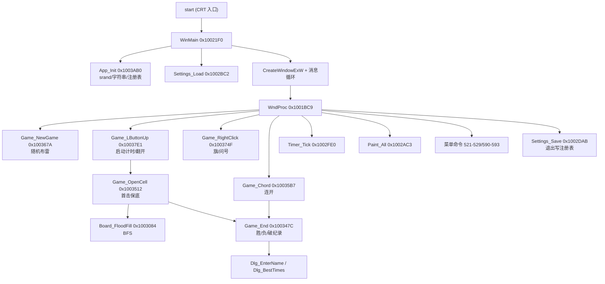

# WINMINE.EXE（Windows XP 扫雷）逻辑还原报告

> 分析日期：2026-08-25
> 分析人员：Codex（IDA 无头自动分析 + 人工核对）
> 工具链：IDA Pro 9.3.251224（Hex-Rays x86 反编译器 / idalib 无头模式）、Python 3.14（自研 PE/资源解析脚本）
> 目标文件：`other/WINMINE.EXE`
> 文档类型：普通 PE 逆向（`flavor = null`，不套恶意软件/APT 结构）

---

## 0. Evidence 链（E → F → P）

### 0.1 Scope 摘要

- 目标：微软 Windows XP 自带扫雷 `WINMINE.EXE`（版本 5.1.2600.0，文件时间 2010-07-16）。
- 授权范围：用户自有/学习复刻项目，本地静态分析，未执行样本、未联网外传。
- 分析产物目录：`other/reverse/`（IDA 导出数据）、`other/extracted/`（资源提取结果）。

### 0.2 Evidence

| E-id | source_ref | repro_command | content_hash |
|---|---|---|---|
| E-imports | `other/reverse/winmine_strings.txt`、IDA 无头导入表 | `python dump_winmine_idalib.py` | n/a（文本导出） |
| E-funcs | `other/reverse/winmine_functions.json`（85 个函数） | 同上 | n/a |
| E-pseudocode | `other/reverse/winmine_pseudocode.txt`（全部函数 Hex-Rays 伪代码） | 同上 | n/a |
| E-disasm | `other/reverse/winmine_disasm.txt`（全部函数反汇编） | 同上 | n/a |
| E-data | `.data` 难度表 / XYZZY / 图块状态，本报告 §3.2 | `python -c` 解析文件偏移 0x4000 | n/a |
| E-menu | `other/extracted/MENU_500.bin` 菜单文字 | 自研 RT_MENU 解析 | n/a |
| E-res | `other/extracted/resources.json`（26 项资源） | `other/extract_resources.py` | n/a |
| E-sample | `other/WINMINE.EXE` | SHA256：`bcff89311d792f64…` | bcff89311d792f64…（前 16 字节） |

### 0.3 Findings

| F-id | severity | evidence_ids | confidence | location | status |
|---|---|---|---|---|---|
| F-1 原版为未加壳 MSVC 7.0 C 程序，资源占文件 85% | n/a_re | E-imports, E-res, E-sample | high | PE 头/.rsrc | 完成 |
| F-2 棋盘为 32×27 字节数组，格值低 5 位=图块、bit6=翻开、bit7=雷 | n/a_re | E-pseudocode, E-data | high | `byte_1005340` | 完成 |
| F-3 布雷用 `rand()%w/h` 随机放置，首击踩雷会把雷挪到另一格（保底） | n/a_re | E-pseudocode | high | `sub_100367A` / `sub_1003512` | 完成 |
| F-4 翻开用 BFS 洪水填充，队列 100 格循环复用 | n/a_re | E-pseudocode | high | `sub_1003084` | 完成 |
| F-5 连开（chord）条件：已翻开数字 == 周围旗数，踩到雷则判负 | n/a_re | E-pseudocode | high | `sub_10035B7` | 完成 |
| F-6 计时器 1 秒 WM_TIMER，上限 999；首次点击才启动 | n/a_re | E-pseudocode | high | `sub_10037E1` / `sub_1002FE0` | 完成 |
| F-7 设置/最高分存 `HKCU\Software\Microsoft\winmine`；win.ini 回退文件名是字面量 `"entpack.ini"`（作者构建残留） | n/a_re | E-pseudocode, E-data | medium | `sub_1002BC2` / `sub_1003AB0` | 完成 |
| F-8 内置经典作弊：输入 `XYZZY` 后按 Shift，屏幕左上角 (0,0) 像素黑/白显示悬停格是否为雷 | n/a_re | E-pseudocode, E-data | high | `word_1005034` / WndProc | 完成 |
| F-9 画面管线：16 个 16×16 方块贴图在加载时预渲染为 DC，绘制全走 `BitBlt`/`SetDIBitsToDevice` | n/a_re | E-pseudocode | high | `sub_1002414` / `sub_10026A7` | 完成 |

### 0.4 Path

- **P-1（callflow 主调用链）**：`start(CRT)` → `WinMain(sub_10021F0)` → `App_Init(sub_1003AB0)` / `Settings_Load(sub_1002BC2)` → `CreateWindowExW` → 消息循环 → `WndProc(sub_1001BC9)` → `Game_NewGame(sub_100367A)` → 鼠标处理（`Game_LButtonUp(sub_10037E1)` / `Game_RightClick(sub_100374F)` / `Game_Chord(sub_10035B7)` / `Game_OpenCell(sub_1003512)`）→ `Game_End(sub_100347C)` → 最高分/名字对话框。
- **P-2（数据流）**：难度表/注册表 → 棋盘数组 `byte_1005340`（逻辑）+ `byte_1005360`（显示）→ 图块索引 & 0x1F → `hdcSrc[]` 预渲染 DC → `BitBlt` 到窗口。

### 0.5 Timeline 摘要

2026-08-25：资源提取完成（`other/extracted/`）→ IDA 无头分析完成（`other/reverse/`）→ 全函数语义核对 → 本报告。

---

## 1. 目标概述

| 属性 | 值 |
|---|---|
| 文件名 | WINMINE.EXE |
| 文件类型 | PE32（x86，GUI 子系统） |
| 大小 | 119,808 字节 |
| 编译时间戳 | 2001-08-17 20:54 UTC |
| 编译器 | MSVC 7.0（链接器版本 7.0，VC.NET 时代） |
| 加壳/保护 | 无（未加壳、未混淆） |
| ImageBase | 0x01000000 |
| 入口点 | 0x1003E21（CRT 启动） |
| 版本信息 | 5.1.2600.0（Windows XP） |
| 资源 | 26 项：6 位图 + 8+1 图标 + 3 WAV + 菜单/对话框/加速键/字符串/版本/清单 |

## 2. 分析目标

本项目以数据驱动方式复刻 WinXP 扫雷，本报告回答四个问题：

1. 原版棋盘数据结构与格值编码是什么？
2. 布雷、翻开、洪水填充、连开、终局判定的精确逻辑是什么？
3. 画面如何用位图条绘制（图块编号 ↔ 视觉状态）？
4. 计时、音效、设置持久化、作弊等外围行为如何实现？

## 3. 静态分析

### 3.1 基本信息

节表只有三节，`.rsrc` 占绝对大头：

| 节 | 虚拟地址 | 文件偏移 | 大小 | 熵 | 说明 |
|---|---|---|---|---|---|
| .text | 0x1001000 | 0x400 | 15,360 | 6.30 | 代码（含 .idata 合并） |
| .data | 0x1005000 | 0x4000 | 512（虚拟 2968） | 2.32 | 全局变量/棋盘/字符串 |
| .rsrc | 0x1006000 | 0x4200 | 102,912 | 7.20 | 位图/图标/声音/菜单等 |

#### 3.1.1 导入表（E-imports）

| DLL | 关键导入 | 对应功能 |
|---|---|---|
| msvcrt | `rand` / `srand` | 布雷随机数 |
| ADVAPI32 | `RegOpenKeyExA` / `RegQueryValueExW` / `RegSetValueExW` / `RegCreateKeyExW` / `RegCloseKey` | 设置与最高分持久化 |
| KERNEL32 | `FindResourceW` / `LoadResource` / `LockResource` / `GetTickCount` / `SetTimer` 相关 | 资源加载、随机种子、计时 |
| GDI32 | `BitBlt` / `SetDIBitsToDevice` / `CreateCompatibleDC` / `SetPixel` / `LineTo` / `SetROP2` | 全部画面绘制（含作弊像素） |
| USER32 | `RegisterClassW` / `CreateWindowExW` / `GetMessageW` / `LoadStringW` / `DialogBoxParamW` / `SetTimer` / `PlaySoundW`（在 WINMM） | 窗口/消息/对话框/字符串 |
| WINMM | `PlaySoundW` | 音效（资源 432/433/434） |
| SHELL32 | `ShellAboutW` | 关于对话框 |
| COMCTL32 | `InitCommonControlsEx` | 通用控件初始化 |

### 3.2 数据布局（E-data）

#### 3.2.1 棋盘数组

- `byte_1005340[864]`：逻辑棋盘，**32 列 × 27 行**（固定上限，实际尺寸由宽度/高度决定）。
- `byte_1005360[864]`：显示棋盘副本（整盘重绘用）。

格值编码（低 5 位为图块索引，高 3 位为状态位）：

| 位 | 含义 |
|---|---|
| bit0-4 | 图块编号（见下方状态机） |
| bit5 | 未使用（保留） |
| bit6 (0x40) | 已翻开 |
| bit7 (0x80) | 是雷 |

#### 3.2.2 图块状态机

| 编号 | 含义 | 出现时机 |
|---|---|---|
| 0 | 已翻开空格（同时也是"按下"的未翻开格外观） | 翻开 0 雷格 / 鼠标按下 |
| 1–8 | 已翻开数字（周围雷数） | 翻开 |
| 9 | 问号按下态 | 鼠标按住问号格 |
| 10 | 终局显示的雷 | 失败后未标旗的雷 |
| 11 | 终局显示的错旗（×） | 失败后标错的旗 |
| 12 | 踩中的雷（爆炸红底） | 点击雷 |
| 13 | 问号（?） | 右键循环第二态 |
| 14 | 旗 | 右键标旗 |
| 15 | 未翻开（凸起） | 初始状态 |
| 16 | 边框 | 棋盘外圈 |

右键循环：`15(未翻开) → 14(旗) → 13(问号，若开启) → 15`；关闭问号时 `14 → 15`。

#### 3.2.3 难度表（`dword_1005010`，格式：雷数 / 高度 / 宽度）

| 难度 | 菜单 ID | 雷数 | 高 | 宽 |
|---|---|---|---|---|
| 初级 Beginner | 521 | 10 | 9 | 9 |
| 中级 Intermediate | 522 | 40 | 16 | 16 |
| 高级 Expert | 523 | 99 | 16 | 30 |
| 自定义 Custom | 524 | 10–999 | 9–24 | 9–30 |

#### 3.2.4 关键全局变量

| 变量 | 含义 |
|---|---|
| `dword_1005334` / `dword_1005338` | 列数（宽）/ 行数（高） |
| `uValue` / `dword_10056AC` / `dword_10056A4` | 自定义高 / 自定义宽 / 自定义雷数 |
| `dword_10056A0` | 难度（0-3） |
| `dword_1005330` | 布雷剩余数 / 雷数副本 |
| `dword_1005194` | 剩余雷数显示值（可负） |
| `dword_100579C` | 计时秒数（上限 999） |
| `dword_1005164` / `dword_1005168` | 计时器运行中 / 暂停前状态 |
| `dword_1005160` | 笑脸状态（0 正常，1 惊讶，2 失败，3 胜利，4 按下） |
| `dword_10057A4` / `dword_10057A0` | 已翻开数 / 需翻开总数（宽×高−雷） |
| `dword_10051A0[100]` / `dword_10057C0[100]` / `dword_1005798` | 洪水填充 BFS 队列 |
| `dword_1005118` / `dword_100511C` | 当前悬停格（列/行） |
| `dword_1005140` / `dword_1005144` / `dword_1005148` / `dword_100514C` | 左键捕获中 / 连开模式 / 暂停（最小化）/ 右键按下 |
| `dword_1005154` | 作弊键序列进度（5=待 Shift，17=作弊开启） |
| `dword_1005000` | 游戏状态标志（bit0=进行中，bit1=已暂停，bit4=已结束） |
| `dword_10056B8` / `dword_10056BC` / `dword_10056C8` / `dword_10056C4` | 声音（3=开）/ 问号标记 / 颜色模式 / 菜单栏状态 |
| `dword_10056CC` / `dword_10056D0` / `dword_10056D4` | 三档最高分（秒） |
| `ReturnedString` / `word_1005718` / `word_1005758` | 三档纪录名字 |
| `hdcSrc[16]` / `dword_1005980[16]` | 预渲染方块 DC / 位图 |
| `dword_10059C0[16]` / `dword_1005A60[10]` / `dword_1005960[5]` | 方块 / 数字 / 笑脸位图条内偏移 |
| `word_1005034[5]` | 作弊序列 `"XYZZY"` |

#### 3.2.5 字符串资源映射

| 字符串 ID | 内容 | 用途 |
|---|---|---|
| 17 | Minesweeper | 窗口类名/标题、win.ini 节名 |
| 20 | Unable to allocate a timer... | 计时器失败错误 |
| 21 | Out of Memory | 内存错误 |
| 23 | %d seconds | 最高分时间格式 |
| 24 | Anonymous | 默认纪录名 |
| 25–27 | You have the fastest time for ... level | 破纪录提示 |
| 28–29 | Minesweeper / by Robert Donner and Curt Johnson | 关于对话框 |

### 3.3 函数地图（85 个函数，E-funcs）

游戏自有函数（按地址排序）：

| 地址 | 还原名 | 职责 |
|---|---|---|
| 0x100140C | Smiley_HandleMouse | 笑脸按钮按下/释放/点击（开始新局） |
| 0x1001516 | Menu_RefreshChecks | 刷新难度/选项勾选 |
| 0x10015A6 | Dlg_Custom | 自定义难度对话框（高 141/宽 142/雷 143） |
| 0x10016BA | Dlg_SetTimeNameRow | 最高分行格式化（%d seconds + 名字） |
| 0x10016FA | Dlg_BestTimes | 最高分对话框（701/703/705，707=清零） |
| 0x100181F | Dlg_EnterName | 新纪录名字输入（602） |
| 0x1001915 | Sys_GetMetric | GetSystemMetrics 封装（标题/边框/菜单尺寸） |
| 0x1001950 | Window_Resize | 按棋盘尺寸移动/调整窗口 |
| 0x1001B49 | Game_CustomAndStart | 自定义对话框后按难度 3 开局 |
| 0x1001B81 | Game_EnterName | 弹出名字输入 |
| 0x1001BAA | Game_BestTimes | 弹出最高分 |
| 0x1001BC9 | WndProc | 主窗口过程（全部消息分发） |
| 0x10021F0 | WinMain | 注册窗口/创建窗口/消息循环 |
| 0x10023CD | Res_FindBitmap | 按颜色模式取 410/411、420/421、430/431 |
| 0x10023F1 | Bmp_Stride | DIB 行字节数计算 |
| 0x1002414 | Gfx_LoadBitmaps | 加载位图并预渲染 16 个方块 DC |
| 0x1002607 | Gfx_FreeBitmaps | 释放 DC/位图/画笔 |
| 0x100263C | Gfx_Cleanup | 退出清理 |
| 0x1002646 | Board_DrawCell | 画单格（16×16 BitBlt） |
| 0x10026A7 | Board_DrawAll | 整盘重绘（显示副本 byte_1005360） |
| 0x100272E | Board_RedrawAll | 取 DC 后整盘重绘 |
| 0x1002752 | Gfx_DrawDigit | 画 13×23 数字 |
| 0x1002785 | Counter_Draw | 剩余雷数三位显示（可负号） |
| 0x1002801 | Counter_Redraw | 重绘雷数 |
| 0x1002825 | Timer_Draw | 计时三位显示 |
| 0x10028B5 | Timer_Redraw | 重绘计时 |
| 0x10028D9 | Smiley_Draw | 画 24×24 笑脸 |
| 0x1002913 | Smiley_Redraw | 重绘笑脸 |
| 0x100293D | Gfx_SetPen | 设置 ROP/边框画笔 |
| 0x1002971 | Gfx_DrawBevel | 画 3D 凸/凹边框 |
| 0x1002A22 | Gfx_DrawFrame | 窗口面板/计时/笑脸外框 |
| 0x1002AC3 | Paint_All | WM_PAINT：边框+雷数+笑脸+计时+棋盘 |
| 0x1002AF0 | Paint_RedrawAll | 强制全重绘 |
| 0x1002B14 | Gfx_Init | 加载位图+初始化棋盘 |
| 0x1002B27 | Reg_ReadInt | 注册表读整数（带范围钳制） |
| 0x1002B80 | Reg_ReadString | 注册表读字符串 |
| 0x1002BC2 | Settings_Load | 读取全部设置/最高分 |
| 0x1002D55 / 0x1002D7A | Reg_WriteInt / Reg_WriteString | 注册表写设置 |
| 0x1002DAB | Settings_Save | 退出时写回注册表 |
| 0x1002EAB | Board_SetCell | 设置格值并重绘单格 |
| 0x1002ED5 | Board_Init | 棋盘清零/画边框（全部 15，外圈 16） |
| 0x1002F3B | Board_CountMines | 3×3 邻域雷数（bit7） |
| 0x1002F80 | Board_EndState | 终局转换：未标雷→10，错旗→11，胜利雷→14 |
| 0x1002FE0 | Timer_Tick | WM_TIMER：秒数+1（上限 999）并滴答 |
| 0x1003008 | Board_OpenCell | 翻开单格：计数、置数字、0 雷入队 |
| 0x1003084 | Board_FloodFill | BFS 洪水填充（队列 100） |
| 0x1003119 | Board_CountFlags | 3×3 邻域旗数（图块 14） |
| 0x100316B / 0x10031A0 | Cell_SetPressed / Cell_SetReleased | 按下/释放视觉状态切换 |
| 0x10031D4 | Board_UpdateHover | 悬停高亮（普通单格 / 连开 3×3） |
| 0x100341C / 0x100344C | Pause_On / Pause_Off | 最小化暂停/恢复计时 |
| 0x100346A | Counter_Adjust | 雷数显示增减 |
| 0x100347C | Game_End | 终局：笑脸、转换、音效、破纪录判断 |
| 0x1003512 | Game_OpenCell | 左键翻开入口（含首击雷保底） |
| 0x10035B7 | Game_Chord | 连开：数字==周围旗数时翻开邻居 |
| 0x100367A | Game_NewGame | 开局：清盘、随机布雷、重置计时/雷数 |
| 0x100374F | Game_RightClick | 右键旗/问号循环 |
| 0x10037E1 | Game_LButtonUp | 左键松开：启动计时、翻开或连开 |
| 0x10038C2 / 0x10038D7 | Sound_Set / Sound_Stop | 声音开（purge+2→3）/ 停 |
| 0x10038ED | Sound_Play | 播 432（点击/滴答）/433（胜）/434（负） |
| 0x1003940 | Rand | `rand() % n` |
| 0x1003950 | Error_Show | MessageBox 错误 |
| 0x10039E7 | Str_LoadString | LoadStringW 封装 |
| 0x1003A12 / 0x1003A87 | Ini_ReadInt / Ini_ReadString | win.ini 回退读取 |
| 0x1003AB0 | App_Init | srand、加载字符串、注册表/ini 设置 |
| 0x1003CC4 / 0x1003CE5 | Menu_Check / Menu_Apply | 勾选管理、菜单显示切换 |
| 0x1003D1D | About_Show | ShellAboutW |
| 0x1003D76 | Help_Show | 构造 .chm 路径并调 HTML Help |
| 0x1003DF6 | Dlg_GetInt | 对话框整数读取+范围钳制 |
| 0x1004062 / 0x10040FB | Help_HtmlHelp / Reg_HtmlHelpPath | 加载 hhctrl.ocx（CLSID 查注册表） |
| 0x1003E21 等 | start / CRT 启动 | VC7 CRT 入口与运行时 |

### 3.4 核心逻辑还原（E-pseudocode）

#### 3.4.1 开局与布雷（`Game_NewGame` 0x100367A + `Rand` 0x1003940）

```c
// 流程：停表 → 按设置更新宽高 → 清盘 → 随机布雷 → 重置状态。
void Game_NewGame()
{
    GameRunning = 0;                       // 停计时
    Board_Init();                          // 全部格=15，外圈=16
    SmileyState = 0;                       // 正常笑脸
    MinesLeft = MineCount;                 // 雷数副本
    // 随机布雷：rand()%w + 1, rand()%h + 1，遇雷重抽
    do {
        do {
            col = Rand(BoardCols) + 1;
            row = Rand(BoardRows) + 1;
        } while (IsMine(cell));            // 已布雷则重抽
        cell |= 0x80;                      // 置雷位
    } while (--MinesLeft);

    TimerSeconds = 0;
    MineDisplay = MineCount;
    OpenedCount = 0;
    NeedOpen = BoardCols * BoardRows - MineCount;  // 需翻开的非雷格数
    StateFlags = 1;                        // 进行中
    Counter_Redraw();
    Window_Resize(是否改变尺寸);
}
```

#### 3.4.2 翻开与洪水填充（`Board_OpenCell` / `Board_FloodFill`）

```c
// 翻开一格：置已翻开位，统计 3×3 邻域雷数写入低 5 位；
// 若为 0 雷则入 BFS 队列，由 Board_FloodFill 逐层展开。
int Board_OpenCell(int col, int row)
{
    int idx = col + 32 * row;
    int v = board[idx];
    if (v & OPENED) return v;              // 已翻开
    v &= 0x1F;
    if (v == 16 || v == 14) return v;      // 边框/旗不翻开
    OpenedCount++;
    int n = CountMines(col, row);          // 3×3 雷数
    board[idx] = n | OPENED;               // 数字 + 翻开位
    DrawCell(col, row);
    if (n == 0) {                          // 0 雷入队，洪水填充
        queueX[queueTail] = col;
        queueY[queueTail] = row;
        queueTail = (queueTail + 1) % 100;
    }
}

// BFS：从队头逐格取 8 邻居继续翻开，直到队列追上队尾。
void Board_FloodFill(int col, int row)
{
    queueTail = 1;
    Board_OpenCell(col, row);
    for (int i = 1; i != queueTail; i = (i + 1) % 100)
        for (dy = -1..1) for (dx = -1..1)
            Board_OpenCell(queueX[i] + dx, queueY[i] + dy);
}
```

#### 3.4.3 首击保底（`Game_OpenCell` 0x1003512）

```c
// 若第一击就点到雷且尚无任何格子翻开：
// 在显示数组中找第一个非雷格，把雷"移"过去，再正常翻开当前格。
if (IsMine(cell)) {
    if (OpenedCount == 0) {
        for (row = 1..Height)
            for (col = 1..Width)
                if (display[row*32+col] >= 0) {   // 非雷格
                    board[row*32+col] |= MINE;    // 它变成雷
                    break;
                }
        cell = COVERED;                          // 当前格变回未翻开
    }
    Board_FloodFill(col, row);
}
```

#### 3.4.4 右键循环（`Game_RightClick` 0x100374F）

```c
// 仅对未翻开格生效：15→14(旗，雷数-1)，14→13(问号)或15，13→15。
// 若"问号标记"关闭则 14 直接回 15。
switch (cell & 0x1F) {
case FLAG:   newTile = QuestionMarks ? QUESTION : COVERED; MineDisplay++; break;
case QUESTION: newTile = COVERED; break;
default:     newTile = FLAG; MineDisplay--; break;
}
Board_SetCell(col, row, newTile);
// 若刚标的旗使"已翻开数==总数"，判胜。
```

#### 3.4.5 连开 chord（`Game_Chord` 0x10035B7）

```c
// 条件：当前格已翻开，且其数字 == 周围旗数。
// 逐个翻开 8 邻居；若邻居是雷则标爆炸(12)并判负。
for (dy = -1..1) for (dx = -1..1) {
    if (邻居是旗 || 邻居非雷) Board_FloodFill(nx, ny);
    else { 标爆炸; lost = 1; }
}
if (lost) Game_End(LOSE);
else if (OpenedCount == NeedOpen) Game_End(WIN);
```

#### 3.4.6 终局（`Game_End` 0x100347C）

```c
// 停表；笑脸：胜=3（墨镜），负=2（挂）；
// 棋盘转换：胜→所有雷变旗(14)；负→未标雷=10，错旗=11；
// 音效：胜=433，负=434；
// 破纪录（非自定义难度且用时更短）：弹名字输入，再弹最高分榜。
```

#### 3.4.7 计时（`Game_LButtonUp` / `Timer_Tick`）

```c
// 首次点击且未计时：播点击声(432)，秒数+1，SetTimer(hWnd, 1, 1000ms)；
// WM_TIMER：GameRunning 且 <999 时秒数+1，重绘计时，播 432 滴答。
```

#### 3.4.8 绘制管线（`Gfx_LoadBitmaps` / `Board_DrawAll`）

```c
// 加载三张位图条（颜色模式 410/420/430，黑白模式 411/421/431）；
// 用 CreateCompatibleDC+CreateCompatibleBitmap+SetDIBitsToDevice
// 把 16 个 16×16 方块各自预渲染成独立 DC；
// 绘制时：整盘 BitBlt(显示副本 byte_1005360 的图块号 & 0x1F)；
// 数字/笑脸用 SetDIBitsToDevice 从 420/430 位图条取偏移直绘。
```

### 3.5 图表（diagram-generator）

#### 3.5.1 主调用关系（Mermaid）



#### 3.5.2 棋盘格状态机（Mermaid）

```mermaid
stateDiagram-v2
    [*] --> 未翻开15
    未翻开15 --> 按下0 : 鼠标按下(视觉)
    按下0 --> 未翻开15 : 移出
    未翻开15 --> 数字1-8 : 翻开(计雷)
    未翻开15 --> 空格0 : 翻开(0雷)
    空格0 --> 洪水填充 : BFS 展开
    未翻开15 --> 旗14 : 右键
    旗14 --> 问号13 : 右键(开启问号)
    问号13 --> 未翻开15 : 右键
    数字1-8 --> 连开 : 双击/双键(数字=旗数)
    未翻开15 --> 爆炸12 : 点击雷
    未翻开15 --> 雷10 : 终局(未标)
    旗14 --> 错旗11 : 终局(标错)
```

## 4. 核心发现

1. **数据结构极简**：一个 32×27 字节数组承载全部棋盘状态，格值把"视觉图块"与"翻开/雷"状态位压缩在一字节内，是典型的老式 Win32 内存布局。
2. **首击保底不是布雷时保证，而是点击时"移雷"**：与多数复刻的"第一次点击后布雷"实现不同，原版先布雷，首击踩雷时把雷挪到第一个非雷格。
3. **洪水填充用固定 100 格循环队列**，无递归，无动态分配。
4. **画面全部走位图条预渲染**：16 个方块 DC 在初始化时一次性建好，绘制零计算（只有 BitBlt），这也是 XP 版流畅的原因。
5. **连开是"数字 == 周围旗数"触发**，且连开踩雷立即判负。
6. **设置双通道**：优先注册表 `HKCU\Software\Microsoft\winmine`，注册表缺失时回退 win.ini；回退文件名在二进制里是字面量 `"entpack.ini"`（作者构建残留，非标准名）。
7. **经典作弊完整保留**：键盘序列 `XYZZY`（虚拟键码 0x58 59 5A 5A 59）匹配后按 Shift 切换，开启后悬停任意格，屏幕左上角 (0,0) 像素黑=雷、白=非雷。
8. **声音以资源形式播放**：432=点击/每秒滴答，433=胜利，434=失败（`SND_RESOURCE|SND_ASYNC`）。
9. **最高分只对非自定义难度生效**，破纪录弹名字输入后展示榜单；榜单可一键清零（707 → 999 / "Anonymous"）。

## 5. 复现步骤

```powershell
# 1) 提取资源（已有脚本）
python other/extract_resources.py

# 2) 用 IDA 无头分析并导出函数/伪代码/反汇编（依赖本机 IDA 9.3 + idalib）
$env:IDADIR = "D:\demoapp\IDApro93"
$env:PYTHONPATH = "D:\demoapp\IDApro93\idalib\python"
python other/reverse/dump_winmine_idalib.py
# 产物：other/reverse/winmine_{functions.json,pseudocode.txt,strings.txt,disasm.txt,segments.txt}

# 3) 核对 .data 关键数据
# 文件偏移 0x4000 起：难度表(0x10)、XYZZY(0x34)、帮助主题(0x40/0x78)、
#   "entpack.ini"(0x118 后)等
```

报告中的所有结论均可在 `other/reverse/winmine_pseudocode.txt` 中按地址复核；菜单文字在 `other/extracted/MENU_500.bin`；资源清单在 `other/extracted/resources.json`。

## 6. 遗留问题

- 部分全局变量（如 `uValue` 的实际地址、`dword_10056C0` 用途）未逐一与反汇编交叉核对，但不影响玩法逻辑结论。
- 声音 432 每秒"滴答"的实际听感未在本机复听验证（静态证据充分，未运行样本）。
- 窗口样式 `0xCA0000` 与菜单显示切换（`dword_10056C4`）的交互细节未深挖。

## 7. 附件

| 文件 | 说明 |
|---|---|
| `other/reverse/winmine_functions.json` | 85 个函数清单 |
| `other/reverse/winmine_pseudocode.txt` | 全函数 Hex-Rays 伪代码（59KB） |
| `other/reverse/winmine_disasm.txt` | 全函数反汇编（126KB） |
| `other/reverse/winmine_strings.txt` | 字符串与引用 |
| `other/reverse/winmine_segments.txt` | 段信息 |
| `other/reverse/dump_winmine_idalib.py` | IDA 无头导出脚本（可复现） |
| `other/extracted/` | 原版 26 项资源（位图/声音/菜单/对话框/字符串表） |
| `other/WINMINE.EXE.i64` | IDA 分析数据库（已保存，可继续深入） |

> 版权说明：WINMINE.EXE 属微软，本报告仅用于本地学习与复刻参考，分析产物勿对外发布或商用。
