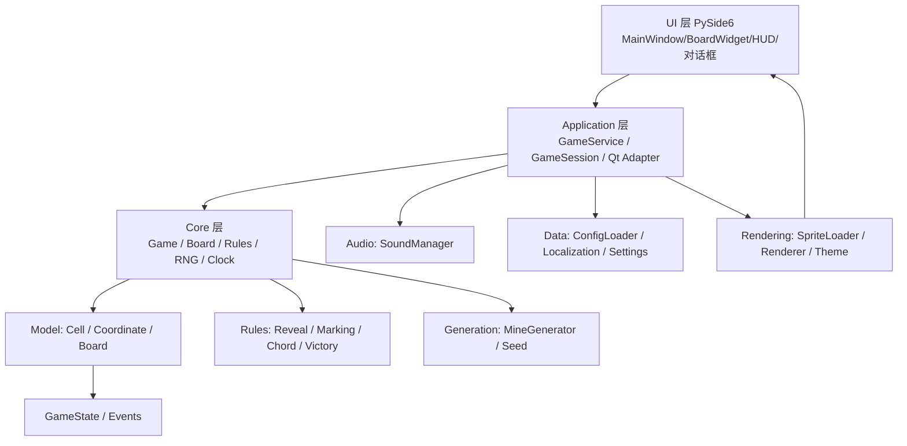

# Minesweeper-XP 开发文档

> 版本：v1.0（文档）　更新日期：2026-08-25
>
> 本文档是项目实施期的唯一开发依据，把「计划」转化为可执行的「开发规格」：
>
> - 蓝图来源：`docs/deepseek-项目计划v2.md`（规格与资源）、`docs/gpt-项目计划v2.md`（架构与工程）
> - 逻辑基准：`docs/2026-08-25_逆向-WINMINE逻辑还原-report.md`（原版 WINMINE 5.1 行为）
> - 资源来源：`other/extract_resources.py` 提取产物（`res/`）
>
> 目标平台：Windows　技术栈：Python 3.14.7 + PySide6（≥6.10）

## 0. 开发前必读（Warnings & Prerequisites）

- **遵守 AGENTS.md**：所有函数必须有作用/参数说明注释，类字段注明含义；仅修改注释不触发代码审查；**本地不自动运行测试**（pytest 一律手动执行）。
- **PySide6 尚未安装**：执行 `uv sync` 安装（推荐最新版 uv）；若 cp314 轮子缺失，`uv python pin 3.13` 后重新 `uv sync`。
- **资源版权**：`res/` 中的位图/音效来自微软原版，仅限本地学习；公开分发前必须替换（见 §15）。
- **以逆向报告为准**：本文档所有"原版行为"均可在 `other/reverse/winmine_pseudocode.txt` 与 `other/reverse/winmine_functions.json` 中按函数地址复核（对应关系见 §4.1 对照表）。

## 1. 项目概览与范围

### 1.1 定位

复刻 Windows XP 扫雷（WINMINE 5.1）的 UI 与核心交互，修复原版"窗口不可缩放/DPI 不适配"缺陷，并按数据驱动、可测试、可扩展的软件工程方式实现。优先级原则：**Original Compatibility First**（原版行为优先 → 现代化修复 → 扩展功能）。

### 1.2 功能优先级

| 优先级 | 内容 | 归属版本 |
| --- | --- | --- |
| 必做（P0） | XP 风格 UI、经典规则、三档难度、自定义、鼠标、键盘、Chord、计时、胜负、重启、Resize、DPI | v1 |
| 应做（P1） | 最佳时间、音效、滴答音效设置、主题、设置、中文/英文 | v1 |
| 可做（P2） | Seed、统计、Replay、自动记录破纪录过程（实验） | v1.1+ |
| 实验（P3） | Hint、Probability、No Guess、每日挑战、AI | 不阻塞 v1 |

> 注：优先级编号 P0–P3 与 §20 的实施阶段（阶段 0–7）相互独立，不要混淆。

> v1 的目标是「功能完整可玩 + XP 视觉接近」，精细还原放到后续迭代，避免各模块都停在 80%。

## 2. 技术栈与环境

| 项目 | 决策 |
| --- | --- |
| Python | 3.14.7（本机已装；PySide6 需 ≥6.10） |
| GUI | PySide6 / Qt（QMainWindow、QWidget、QPainter、QPixmap、QTimer、QMenu、QDialog） |
| 依赖管理 | uv（pyproject.toml + uv.lock + .venv） |
| 质量 | pytest（手动）、mypy、ruff |
| 版本控制 | Git + Conventional Commits |
| CI | GitHub Actions（后置可选；仅远端执行） |
| 发布 | PyInstaller（v1.3） |
| 原则 | Core 不依赖 PySide6；类型明确；避免无理由 `Any` / `# type: ignore` |

## 3. 设计原则

1. **Core 与 UI 解耦**：Core 不 import Qt；依赖方向 `UI → Application → Core`。
2. **UI 不实现规则**：鼠标/键盘只产生 Command，UI 只监听 Event，禁止 BoardWidget 直接改 Cell。
3. **数据定义参数，代码定义行为**：难度/主题/文案/配置进 JSON；Reveal/Chord/胜负判定/状态机是代码行为，不进数据。
4. **XP 兼容与现代化改进分离**：所有与原版不一致之处必须登记（见 §19 已知差异）。
5. **扩展不污染 Core**：Replay/AI/Hint 通过 Command/Event 挂在外部，不进入 Cell/Board 内部逻辑。
6. **按需创建模块**：不为"未来可能需要"提前实现；架构预留边界即可。
7. **JSON 是配置源而非领域模型**：Core 只消费 `ConfigLoader` 解析出的数据类，禁止在 Core 里直接 `json.load`。

## 4. 原版行为基准（逆向报告摘要）

### 4.1 行为依据对照表

| 本文档章节 | 原版行为 | 证据 |
| --- | --- | --- |
| §4.2 格值编码 | 低 5 位=图块、bit6=翻开、bit7=雷 | F-2 |
| §6.3 布雷与首击保护 | 原版先布雷+首击移雷；本项目改为点后布雷，安全范围可配（有意差异） | F-3 |
| §6.4 翻开 | BFS 洪水填充（队列 100，无递归） | F-4 |
| §6.5 连开 | 数字==周围旗数才触发，踩雷即负 | F-5 |
| §6.7 计时 | 首击启动、1 秒一跳、上限 999、最小化暂停 | F-6 |
| §8 渲染 | 16 个方块 DC 预渲染，绘制走 BitBlt | F-9 |
| §11 持久化 | 原版用注册表/win.ini；本项目改为 JSON（有意差异） | F-7 |
| §19 已知差异 | XYZZY 作弊不实现 | F-8 |

### 4.2 格值编码（1 字节/格）

棋盘固定 32 列 × 27 行字节数组，外圈为边框格（图块 16），实际宽高由难度决定：

| 位 | 含义 |
| --- | --- |
| bit0–4 | 图块编号（0–16） |
| bit5 | 保留 |
| bit6 (0x40) | 已翻开 |
| bit7 (0x80) | 是雷 |

> 该字节编码为**原版逆向参考**；本项目的 Python 模型使用 Cell 对象 + 二维网格，不复刻压缩字节位。

### 4.3 图块状态机（视觉状态）

| 编号 | 含义 | 出现时机 |
| --- | --- | --- |
| 0 | 翻开空格 / 未翻开格按下外观 | 翻开 0 雷格、鼠标按下 |
| 1–8 | 已翻开数字（周围雷数） | 翻开 |
| 9 | 问号按下态 | 按住问号格 |
| 10 | 终局显示的雷 | 失败后未标旗的雷 |
| 11 | 终局显示的错旗（×） | 失败后标错的旗 |
| 12 | 踩中的雷（红底爆炸） | 点击雷 |
| 13 | 问号（?） | 右键循环第二态 |
| 14 | 旗 | 右键标旗 |
| 15 | 未翻开（凸起） | 初始状态 |
| 16 | 边框 | 棋盘外圈（不绘制） |

### 4.4 难度表（原版）

| 难度 | 菜单 ID | 雷数 | 高(行) | 宽(列) |
| --- | --- | --- | --- | --- |
| 初级 | 521 | 10 | 9 | 9 |
| 中级 | 522 | 40 | 16 | 16 |
| 高级 | 523 | 99 | 16 | 30 |
| 自定义 | 524 | 10–999 | 9–24 | 9–30 |

自定义校验：`10 ≤ mines ≤ min(999, rows×cols−9)`；非法值弹窗拒绝（参考 `Dlg_GetInt` 范围钳制）。

### 4.5 行为细节（实现必须一致）

- **右键循环**：`15 → 14（剩余雷数−1）→ 13（若"标记"开启）→ 15`；标记关闭时 `14 → 15（剩余雷数+1）`。
- **终局转换**：胜利 → 所有雷变为旗（14），且剩余雷数显示归 0；失败 → 未标旗的雷=10、标错的旗=11、踩中的雷=12。
- **笑脸状态**：0 正常、1 惊讶（在棋盘上按住鼠标）、2 失败、3 胜利（墨镜）、4 按下（按住笑脸）。
- **音效**：432=点击/每秒滴答、433=胜利、434=失败；原版 `SND_RESOURCE|SND_ASYNC`，本项目从 `res/sounds/*.wav` 播放。滴答频率可配置：每秒/每分钟/关闭（§13，有意差异）。
- **最佳时间**：仅非自定义难度计入；破纪录先弹名字输入，再展示榜单；榜单可一键清零。
- **加速键**：F1=帮助主题（原版 590）、F2=新游戏（原版 510）。

## 5. 系统架构

### 5.1 分层图



### 5.2 依赖规则

- `core/` 禁止 import `PySide6`、`PyQt*`、任何 Qt 模块。
- `ui/` 禁止实现游戏规则（翻开/布雷/胜负），只能发 Command、收 Event。
- 数据访问统一走 `data/` 层；`res/` 资源访问统一走 `rendering/SpriteLoader`（AssetProvider 模式）。

### 5.3 目录结构（v1）

```text
minesweeper-xp/
├── pyproject.toml / README.md / CHANGELOG.md / LICENSE
├── docs/                     # 计划、开发文档、兼容性记录、ADR
├── res/                      # sprites/ icons/ sounds/ difficulties.json themes/ locales/
├── src/minesweeper_xp/
│   ├── main.py               # 入口：python -m minesweeper_xp
│   ├── core/
│   │   ├── model/            # cell.py coordinate.py board.py
│   │   ├── rules/            # reveal.py marking.py chord.py victory.py
│   │   ├── generation/       # mine_generator.py seed.py
│   │   ├── command.py event.py clock.py game.py enums.py
│   ├── application/          # game_service.py game_session.py qt_adapter.py
│   ├── ui/
│   │   ├── windows/          # main_window.py
│   │   ├── widgets/          # board_widget.py hud_widget.py face_button.py
│   │   ├── dialogs/          # custom_dialog.py best_times_dialog.py name_dialog.py about_dialog.py help_dialog.py
│   ├── rendering/            # sprite_loader.py block_renderer.py hud_renderer.py theme.py
│   ├── geometry/             # board_geometry.py layout.py
│   ├── data/                 # config_loader.py difficulty.py settings.py localization.py
│   ├── audio/                # sound_manager.py
│   └── persistence/          # （v1.1：save_manager.py save_model.py）
├── tests/                    # unit/ integration/ compatibility/ property/ performance/
└── scripts/                  # validate_config.py 等
```

### 5.4 GameState（一等模型）

```python
class GameStatus(Enum):
    READY = auto()  # 未开始（首击前）
    PLAYING = auto()  # 进行中
    WON = auto()  # 胜利
    LOST = auto()  # 失败


@dataclass
class GameState:
    status: GameStatus  # 当前状态
    difficulty: Difficulty  # 当前难度
    board: Board  # 棋盘（Cell 网格）
    remaining_mines: int  # 剩余雷数（可为负）
    elapsed_seconds: int  # 计时秒数（上限 999）
    face_state: FaceState  # 笑脸状态
```

> `Game` 持有唯一 `GameState`：Command 修改它，Event 通知外部；Renderer、Save、Replay、Test 都读取这一份状态，而不是各自维护副本。

## 6. 核心领域模型与算法（Core）

### 6.1 Cell

```python
from enum import Enum, auto


class Mark(Enum):
    NONE = auto()  # 无标记
    FLAG = auto()  # 旗
    QUESTION = auto()  # 问号


@dataclass
class Cell:
    is_mine: bool  # 是否雷（对应 bit7）
    is_revealed: bool  # 是否翻开（对应 bit6）
    mark: Mark  # Mark.NONE / Mark.FLAG / Mark.QUESTION
    adjacent_mines: int  # 3×3 邻域雷数（翻开后有效）
```

> Cell 是**可变**游戏状态（翻开/标记/雷数在局中频繁变更），故不使用 `frozen=True`；
> 位置由 Board 的二维网格承载，Cell 不内嵌 row/col，避免状态漂移。
> 修改只能经由 Core 的规则层（Reveal/Mark/Chord）完成，UI 禁止直接改 Cell 字段。

状态转换（右键循环见 §4.5；翻开见 §6.4）。

### 6.2 Coordinate

- `neighbors8(row, col)`：返回 3×3 内 8 个邻居坐标（自动跳过棋盘外）。
- 坐标体系：逻辑坐标 `(row, col)`；像素坐标 `x = col×16−4`、`y = row×16+39`（基准 100%）；`geometry/` 负责三层换算（见 §9）。

### 6.3 布雷与首击保护（点后布雷，安全范围可配置）

```text
Game_NewGame（点后布雷）：
  1. 停表，清空棋盘，全部格=15，外圈=16
  2. 笑脸=0（正常），剩余雷数=雷数，已翻开=0
  3. 计时=0，剩余雷数显示=雷数；布雷推迟到首次点击时进行
```

```text
首次点击（Game_FirstClick）：
  1. 按 first_click_safe 确定"禁止布雷区"：
       zone3x3 → 以首击格为中心的 3×3 邻域
       cell    → 仅首击格自身
  2. 在禁止布雷区之外的格子中循环布雷（次数=雷数，遇雷重抽），置 bit7
  3. 启动计时，正常执行翻开/洪水填充
```

> 首击保护两种模式（菜单可切换，见 §10.1）：
> - `zone3x3`（默认）：首击 3×3 无雷，现代扫雷的常见做法，比原版更宽松。
> - `cell`：仅首击格安全，忠实还原原版的保证（原版只在首击踩雷时移走这一颗雷）。
>
> 注意：原版并不清空 3×3，因此 `zone3x3` 是超出原版的增强项，已登记在 §19。随机数用 `random.Random(seed)` 封装，v1.1 提供 Seed 复现。

### 6.4 翻开与洪水填充（还原 `Board_OpenCell` / `Board_FloodFill`）

```python
from collections import deque

_queue: deque[tuple[int, int]] = deque()


def open_cell(board, row, col) -> None:
    """翻开单格；0 雷格入 BFS 队列。"""
    v = board[row][col]
    if v.is_revealed:
        return
    if v.mark == Mark.FLAG or is_border(v):
        return  # 旗/边框不翻开
    v.is_revealed = True
    v.adjacent_mines = count_mines_3x3(board, row, col)
    emit(CellRevealed(row, col, v.adjacent_mines))
    if v.adjacent_mines == 0:
        _queue.append((row, col))


def flood_fill(board, row, col) -> None:
    """BFS：逐格展开 8 邻居，无递归，避免 RecursionError。"""
    _queue.clear()
    _queue.append((row, col))
    open_cell(row, col)
    while _queue:
        r, c = _queue.popleft()
        for nr, nc in neighbors8(r, c):
            open_cell(nr, nc)
```

> 队列用 `collections.deque`（无界），不要照搬原版的固定 100 长度循环队列——大棋盘（如 500×500）的空区 BFS 会超过 100 格而溢出。

> 实现时用批量事件：BFS/Chord 先收集被翻开的格子，结束后一次性 `emit(CellsRevealed(cells))`，而不是逐格发 `CellRevealed`。

### 6.5 Chord 连开（还原 `Game_Chord`）

```text
条件：当前格已翻开且为数字，且 数字 == 3×3 内旗数（图块 14）
动作：逐个处理 8 邻居
    - 邻居是旗 → 跳过（不翻开）
    - 邻居非雷 → flood_fill
    - 邻居是雷 → 标爆炸(12)，标记 lost
结果：lost → Game_End(LOSE)；否则若 已翻开==需翻开 → Game_End(WIN)
```

### 6.6 胜负判定

- 胜利：**所有非雷格全部翻开**即胜（`已翻开非雷格数 == 宽×高 − 雷数`）；**雷是否全部标旗不影响胜利**。
- 失败：翻开雷、或 chord 踩雷。
- 终局：`Game_End` 停表、切笑脸、终局图块转换（§4.5）、播音效、破纪录流程。

### 6.7 计时（Clock 抽象）

```python
class Clock(Protocol):
    """Core 只依赖时钟接口，不依赖 QTimer。"""

    def start(self) -> None: ...
    def stop(self) -> None: ...
    def pause(self) -> None: ...  # 最小化暂停（沿用原版）
    def resume(self) -> None: ...
    @property
    def elapsed(self) -> int: ...  # 秒，上限 999
```

- Qt 实现：`QTimer`（1000ms）驱动刷新；测试实现：`FakeClock`（手动推进，无需 sleep）。
- 行为：首次点击才 `start`；最小化 `pause`、恢复 `resume`；胜负/新局 `stop`；显示 3 位 LED，999 封顶。

### 6.8 游戏状态机与命令有效性

| 当前状态 | RevealCell | ToggleMark | ChordCell | RestartGame |
| --- | --- | --- | --- | --- |
| READY | 布雷并进入 PLAYING | 忽略 | 忽略 | 重置为 READY |
| PLAYING | 翻开（可能 LOST/WON） | 标记 | 连开（可能 LOST/WON） | 重置 |
| WON | 忽略 | 忽略 | 忽略 | 重置 |
| LOST | 忽略 | 忽略 | 忽略 | 重置 |

> 终局（WON/LOST）后，除 `RestartGame` 外的所有 Command 一律忽略；这是 Core 的硬性规则，UI 不得绕开。

### 6.9 错误处理约定

- **终局命令**：WON/LOST 下非重启命令 → 忽略（不发错误）。
- **非法坐标/非法难度/非法雷数**：在进入 Core 前由校验层拦截，非法即拒绝（抛 `ValueError` 或返回失败，二选一并统一）。
- **配置缺失/非法**：用户配置 → warning + 默认值；内置资源 → 明确报错。
- 禁止裸 `except Exception: pass`；异常要么被显式处理，要么向上抛出到 Application 层统一兜底。

## 7. Command / Event 设计

### 7.1 Command（统一输入）

| Command | 参数 | 来源 |
| --- | --- | --- |
| `RevealCell` | (row, col) | 左键、空格键 |
| `ToggleMark` | (row, col) | 右键、F 键 |
| `ChordCell` | (row, col) | 中键、双键同按、Enter |
| `RestartGame` | — | F2、笑脸点击、菜单"新游戏" |
| `ChangeDifficulty` | difficulty | 菜单/快捷键 |

> Command 表达的是「玩家意图」，不是「输入设备动作」：Mouse/Keyboard/Replay/AI 都先经过 Input Mapping，再转成同一批 Command。

### 7.2 Event（Core → Application → Qt Signal）

| Event | 携带数据 | UI 反应 |
| --- | --- | --- |
| `GameStateChanged` | status | 状态切换（READY/PLAYING/WON/LOST） |
| `CellRevealed` | (row, col, number) | 重绘单格 |
| `CellsRevealed` | cells=[(row, col, number), ...] | 批量重绘（BFS/Chord） |
| `CellMarked` | (row, col, mark) | 重绘单格 |
| `FlagsChanged` | remaining | 刷新 LED 雷数 |
| `TimerStarted` / `TimerStopped` / `TimerPaused` / `TimerResumed` | — | 计时生命周期（与 Clock 对应） |
| `TimerTicked` | seconds | 刷新 LED 计时 |
| `FaceChanged` | face_state | 刷新笑脸 |
| `GameWon` / `GameLost` | — | 终局重绘 + 音效 + 对话框 |
| `BestTimeUpdated` | (difficulty, entry) | 更新榜单 |

UI 只监听信号并局部重绘，禁止轮询 Core。

> `CellMarked` 负责单格外观更新，`FlagsChanged` 负责雷数计数更新；一次标旗会同时触发两者，职责分开便于局部重绘。
> 批量事件：`CellsRevealed` 覆盖一次翻开多格；单格翻开才用 `CellRevealed`，避免一次 BFS 发几十个单格事件。

## 8. 渲染系统

### 8.1 渲染管线

```text
GameState → RenderModel（图块/数字/笑脸/边框） → Renderer → QPainter
```

Renderer 只读状态，不修改 Game。

### 8.2 资源加载（SpriteLoader / AssetProvider）

- 按主题加载位图条：彩色模式 `blocks_color/digits_color/smiles_color`，单色模式对应 `_mono`（对应原版 410/420/430 与 411/421/431）。
- **注意 BMP 为自下而上存储**：加载后按行翻转，使图块 0–15 与 §4.3 状态一一对应。
- 位图条切块：方块 16×16×16、数字 13×23×12（0–9、负号 index 11、空白 index 10）、笑脸 24×24×5。
- UI 层不直接访问 `res/sprites/*.bmp` 文件名，统一通过 `AssetProvider` 的语义接口取用：`cell_closed/cell_open/mine/flag/question/smile_normal/smile_pressed/smile_won/smile_lost`。
- 数字绘制：剩余雷数可为负（用负号字形）；计时/雷数各 3 位，高位补 0，999 封顶。

### 8.3 HUD 布局常量（基准 100%）

| 元素 | 位置/尺寸 |
| --- | --- |
| 外框 | (0,0)-(W-1,H-1)，3px 内凹 |
| HUD 面板 | (9,9)-(W-10,45)，2px 内凹 |
| 棋盘面板 | (9,52)-(W-10,H-10)，3px 内凹 |
| 雷数 LED | 3 位 13×23，x=17/30/43，y=16 |
| 笑脸 | 24×24，居中（y=15） |
| 计时 LED | 3 位 13×23，右对齐（x=W-56/-43/-30） |
| 棋盘 | 起点 (12,55)，每格 16px |

窗口基准尺寸：宽 = 22 + 16×列数，高 = 65 + 16×行数（不含菜单栏差异）。

### 8.4 3D 边框（Gfx_DrawBevel 对应实现）

用 QPainter 画亮/暗 1px 线段组合成凸起/凹陷：凸起 = 左上白 + 右下灰；凹陷 = 左上灰 + 右下白；按面板宽度循环 1–3 次。颜色取自主题。

## 9. Geometry / Scale / DPI

### 9.1 坐标与缩放层次

```text
Logical（格子 16px，游戏内逻辑）
  ↓ Game Scale（0.5–3.0，连续 float）
  ↓ Qt Logical Pixel（受 devicePixelRatio 影响的逻辑像素）
  ↓ Device Pixel Ratio（系统缩放 100%/125%/150%/200%）
  ↓ Physical Pixel（屏幕物理像素）
```

> 区分「游戏缩放 Game Scale」与「系统 DPI（devicePixelRatio）」：前者是玩家/窗口驱动的棋盘放大，后者是 OS 显示缩放。Qt 自动处理 DPR，项目只需正确设置 QPainter 的 scale。

### 9.2 缩放模型（统一决策）

- 内部：`scale: float`，取值范围 0.5–3.0，允许连续值。
- **用户预设档（离散）**：Ctrl+滚轮 / 视图菜单 50/75/100/125/150/200/300%。
- **自适应 resize（连续）**：窗口 resize 时 `scale = min(可用宽/列数, 可用高/行数)`，保持宽高比不拉伸；像素对齐交给 Renderer（最近邻）。
- **基础/最小**：基础格子 16px（即 100%）；最小窗口由最小格子 8px + HUD + 边框反推，禁止写死常量。
- **DPI**：系统 DPR 由 Qt 处理（见 §9.1）；重点验证 100/125/150/200%。

### 9.3 坐标换算接口（geometry/board_geometry.py）

```text
window_size(difficulty, scale) -> (int, int)   # 宽、高（逻辑像素）
cell_size(scale) -> int                        # 16 * scale
widget_pos_to_cell(x, y) -> (row, col) | None  # 含边界/越界处理，越界返回 None
cell_to_widget_rect(row, col) -> (x, y, w, h)
```

> geometry 层保持**纯函数、无 Qt 类型**（返回 int/tuple），便于脱离 Qt 做单元测试；Qt 类型（QSize/QRect）由 UI 层包一层转换。

## 10. UI 系统

### 10.1 MainWindow

职责：窗口、菜单、布局、对话框、缩放、窗口状态保存。不实现任何游戏规则。

菜单（默认中文，结构同原版）：

- 游戏：新游戏(F2) / 初级 / 中级 / 高级 / 自定义… / 声音☑ / 滴答音效▸(每秒/每分钟/关闭) / 首击保护▸(3×3/仅首格) / 标记☑ / 颜色☑ / 最佳时间… / 退出
- 帮助：帮助主题(F1) / 搜索帮助(置灰) / 使用帮助(置灰) / 关于扫雷

> "滴答音效"与"首击保护"子菜单均为本项目现代扩展（原版无此选项），分别对应 §13 与 §6.3 的设置项。

### 10.2 BoardWidget

职责：鼠标输入（坐标换算 → Command）、键盘输入、按 RenderModel 绘制。

```text
鼠标流程：Mouse Position → Device → Logical → Board Coordinate → Command
```

交互状态机：

- 左键按下：目标格显示按下外观（未翻开→图块 0，问号→图块 9），笑脸变惊讶；按住移出棋盘则恢复。
- 左键松开：在棋盘上则 RevealCell；移出则取消。
- 右键：ToggleMark。
- 中键 / 左右键同按：ChordCell（目标必须为已翻开数字格）。
- 棋盘上按住左键后按右键（或反之）= chord 预览（3×3 同时按下外观），松开触发 chord。

键盘：方向键移动焦点（焦点格高亮边框）、空格翻开、F 标记循环、Enter chord、F2 新游戏、Ctrl+滚轮缩放。

### 10.3 HUD / FaceButton

- HUD：雷数 LED、计时 LED、笑脸，只显示不计算（数据来自 Event）。
- 笑脸：按下显示图块 4；松开若仍在笑脸内则 RestartGame；正常/惊讶/失败/胜利由 FaceChanged 驱动。

### 10.4 对话框

| 对话框 | 内容 | 备注 |
| --- | --- | --- |
| 自定义 | 行/列/雷数（Spinner + 范围校验） | 非法拒绝并提示 |
| 最佳时间 | 三档各 Top 5（时间/名字/日期）+ 重置 | 注明"Top 5 为现代扩展" |
| 输入名字 | 新纪录时弹出，默认"匿名" | 仅非自定义难度 |
| 关于 | 程序名、版本、署名 Robert Donner & Curt Johnson | 原版 ShellAboutW |
| 帮助 | 玩法说明文本（语言包） | 替代原版 .chm |

## 11. 数据驱动设计（JSON Schema）

### 11.1 `res/difficulties.json`

```json
{
  "beginner":      { "rows": 9,  "cols": 9,  "mines": 10 },
  "intermediate":  { "rows": 16, "cols": 16, "mines": 40 },
  "expert":        { "rows": 16, "cols": 30, "mines": 99 },
  "custom_limits": { "min_rows": 9, "max_rows": 24, "min_cols": 9, "max_cols": 30, "min_mines": 10 }
}
```

校验：`10 ≤ mines ≤ min(999, rows×cols−9)`；缺失字段回退三档预设。

> 对应数据类 `Difficulty(rows: int, cols: int, mines: int)`，由 `data/difficulty.py` 从 JSON 解析并校验。

### 11.2 `res/themes/classic_xp.json`

```json
{
  "name": "classic_xp",
  "display_name": { "zh_CN": "经典 XP", "en_US": "Classic XP" },
  "sprites": {
    "blocks": "sprites/blocks_color.bmp",
    "blocks_mono": "sprites/blocks_mono.bmp",
    "digits": "sprites/digits_color.bmp",
    "digits_mono": "sprites/digits_mono.bmp",
    "smiles": "sprites/smiles_color.bmp",
    "smiles_mono": "sprites/smiles_mono.bmp",
    "icon": "icons/app.ico"
  },
  "sizes": { "cell": 16, "digit": [13, 23], "smile": 24 },
  "colors": { "background": "#C0C0C0", "led_bg": "#000000", "led_fg": "#FF0000" }
}
```

加载失败 → 回退内置默认主题并告警（禁止静默）。

### 11.3 `res/locales/zh_CN.json` / `en_US.json`

键值对语言包（`app_title`、`menu_*`、`custom_dialog.*`、`best_times.*`、`winner_name.*`、`about.*`、`help_text.*`）。全部界面文字必须来自 Localization，禁止硬编码 `"游戏"` 之类的字符串。

### 11.4 用户配置 `config.json`（AppData/minesweeper_xp/）

| 字段 | 类型 | 默认 | 说明 |
| --- | --- | --- | --- |
| `language` | string | `zh_CN` | 界面语言 |
| `theme` | string | `classic_xp` | 当前主题 |
| `sound` | bool | true | 音效开关 |
| `volume` | float | 0.8 | 0.0–1.0 |
| `tick_sound` | string | `second` | 滴答音效：`second`(每秒)/`minute`(每分钟)/`off`(关闭) |
| `first_click_safe` | string | `zone3x3` | 首击保护：`zone3x3`(3×3)/`cell`(仅首格) |
| `marks` | bool | true | 问号标记 |
| `color` | bool | true | 彩色/单色 |
| `window` | object | — | 宽/高/缩放 |
| `best_times` | object | 空 | 每难度 Top 5 |

错误处理：用户配置读取失败 → warning + 默认值；内置资源读取失败 → 明确报错（禁止静默吞掉）。统一使用标准库 `logging` 分级输出（配置回退/资源缺失为 warning，内部资源错误为 error）。

## 12. 持久化与高分（v1）

- 存储位置：`QStandardPaths.AppDataLocation/minesweeper_xp/config.json`（有意差异：原版写注册表 `HKCU\Software\Microsoft\winmine`）。
- 最佳时间：**仅初级/中级/高级三档标准难度参与计分排名**，自定义难度不计入；每难度 Top 5（name/time/date）；破纪录弹名字输入（默认"匿名"）；榜单可重置（还原为 999 / "Anonymous"）。
- **自动记录破纪录过程（实验功能，v1.1+）**：每局在内存中记录操作序列（时间戳 + 命令 + 坐标）；当该局刷新某标准难度纪录时，把记录持久化到 `records/`（JSON，格式见 §16），最佳时间条目附带记录文件引用；后续版本可在最佳时间对话框回放该过程。
- 退出时保存窗口位置/尺寸/缩放/语言/主题/音效设置。

> v1 只保留 config + best_times 两类持久化；save/replay/records 的 repository 拆分在 v1.1（§16）再做，避免过度设计。

## 13. 音频系统

- Core 只产生事件（`CellRevealed`/`CellMarked`/`GameWon`/`GameLost`），Audio 层响应事件播放。
- 映射：点击声 → `res/sounds/tick.wav`；胜利 → `win.wav`；失败 → `lose.wav`。
- **滴答声（计时）**：由 `tick_sound` 设置控制——`second`：每秒播 tick.wav；`minute`：每 60 秒播一次；`off`：不播。点击声始终受主声音开关 `sound` 控制。
- 所有音效受 `sound` 开关与 `volume` 控制（QSoundEffect）。

## 14. 国际化

- v1 支持 `zh_CN`（默认）与 `en_US`；`res/locales/` 两个 JSON。
- `Localization` 提供 `tr(key) -> str`；切换语言后全 UI 立即重绘（retranslateUi 模式）并持久化。
- 中文字体：使用系统字体回退（如微软雅黑），不依赖 XP 字体。

## 15. 资源与版权策略

- 开发环境：允许使用 `res/` 原版提取资源做本地研究与验证。
- 公开仓库：不提交未经许可的微软原版资源；提供 `res/README.md`（资源来源、使用范围、版权状态、公开替换方案）。
- 最终公开版：使用自制资源或明确可再分发资源；架构已通过 Theme/AssetProvider 预留替换点。

## 16. 存档与后续扩展（v1.1 预留，不实现）

- Save/Load：JSON、带 `format_version`，格式独立于 Core；字段：difficulty/width/height/mine_count/seed/state/elapsed_time/cells。
- Seed：`MineGenerator` 接受 seed，同 seed 同棋盘。
- Replay：记录 `(elapsed_ms, command, row, col)` 事件流回放，不记录截图。
- **自动记录破纪录过程（实验）**：每局实时记录上述事件流；局终若刷新标准难度纪录，将记录写入 `records/<difficulty>_<time>_<timestamp>.json` 并关联到最佳时间条目（§12）。记录格式与 Replay 兼容，v1.1+ 可在最佳时间对话框回放。
- Persistence 分层：领域对象不直接读写 JSON，走 `*Repository`（config/best_time/save/replay），v1.1 再拆分。
- 以上均为 v1.1+，v1 不实现但保持 Command/Event 边界兼容。

## 17. 测试体系

> 本地手动运行（遵守 AGENTS.md）；CI 若启用仅在远端执行。

### 17.1 单元测试（tests/unit/）

- Cell 状态转换、Coordinate 邻居/边界。
- MineGenerator：雷数正确、不越界、seed 可复现、不同 seed 布局不同。
- 首击保护：`zone3x3` 模式首击 3×3 无雷；`cell` 模式仅首击格无雷；非法配置回退默认。
- Reveal：单格、0 区扩散、角落/边界、重复翻开、旗不翻开。
- Chord：旗数=数字触发、旗错引爆、踩雷判负。
- 右键循环：开启/关闭"标记"两种路径。
- Victory/Lose：全开安全格即胜、插旗不开不全胜、踩雷即败。
- 计时：首击启动、999 封顶、暂停/恢复（FakeClock）。

### 17.2 集成测试（tests/integration/）

`Command → Game → Event` 全链路；对话框流程（自定义校验、破纪录 → 名字 → 榜单）。

### 17.3 兼容性测试（tests/compatibility/）

按 §4.5 行为细节逐项验证（左键/右键/旗/问号/chord/重启/计时/胜负/终局图块转换）。

### 17.4 Geometry 测试

窗口↔棋盘↔格子↔像素双向换算；50/125/150/200/300%；窗口过小/过大/非整数缩放/奇数尺寸。

### 17.5 属性与性能测试（后期）

- 属性：Hypothesis 验证"实际雷数==配置雷数"、"adjacent_mines==实际邻居雷数"。
- 性能：9×9 / 16×16 / 30×16 / 100×100 / 500×500 的布雷、翻开、渲染耗时。

### 17.6 UI 手工验收 + 视觉对照

- 三档难度完整对局；单色/颜色切换；缩放/高 DPI；主题与语言切换；键盘全操作；音效开关。
- 运行 `other/WINMINE.EXE` 截图逐项对照（布局/配色/方块/笑脸）；后期建立 `tests/visual/` 基准截图回归。

## 18. 工程规范与 CI

- 注释：函数作用+参数说明、类字段含义（AGENTS.md）；仅注释修改不触发代码审查。
- 质量门：`ruff check`、`ruff format --check`、`mypy src`、手动 `pytest`。
- Git：Conventional Commits（feat/fix/refactor/test/docs/build/chore），一提交一逻辑。
- DoD：需求明确 → 设计 → 实现 → 类型标注 → 单测 → 集成/兼容测试（如需要）→ ruff → mypy → 手动验证 → 文档更新。
- ADR（从第一天编号，存 `docs/adr/`）：
  - ADR-001 使用 Python + PySide6
  - ADR-002 Core 与 Qt 解耦
  - ADR-003 Command/Event 架构
  - ADR-004 Cell 使用可变 dataclass（而非 frozen / 原版 byte array）
  - ADR-005 延迟布雷 + 首击保护可配
  - ADR-006 JSON 持久化（而非注册表 / QSettings）
  - ADR-007 QPainter 自绘 XP UI（提取资源 vs 程序化绘制）
  - ADR-008 Geometry / Game Scale / DPI 缩放模型
  - ADR-009 本地化方案（JSON 语言包）

## 19. 已知差异（Intentional Deviations / Known Differences）

| 项目 | 原版 | 本项目 | 原因 |
| --- | --- | --- | --- |
| 布雷时机 | 先布雷 + 首击移雷 | 点后布雷，首击保护可选（3×3/仅首格） | 实现更简洁、易支持 Seed、习惯可配 |
| 持久化 | 注册表 + win.ini("entpack.ini") | AppData JSON | 跨平台、可读、数据驱动 |
| 窗口 | 固定尺寸 | 自由缩放 + 高 DPI | 现代环境修复 |
| 最佳时间 | 每档 1 条 | Top 5 | 现代扩展（对话框中注明） |
| 滴答音效 | 固定每秒 | 每秒/每分钟/关闭可选 | 现代扩展 |
| 破纪录过程 | 不记录 | 自动记录并可回放（实验） | 复盘/学习价值 |
| 语言 | 跟随系统 | 内置中/英切换，默认中文 | 用户需求 |
| 帮助 | 外部 .chm | 内置说明对话框 | 无帮助文件 |
| 作弊 XYZZY | 支持 | 不实现 | 无必要且复杂化 |
| 音量 | 无 | 可调音量 | 现代扩展 |
| 音效来源 | 原版 WAV 资源 | 提取自原版，本地使用 | 版权策略 §15 |

## 20. 实施阶段与里程碑

| 阶段 | 内容 | 验收标准 |
| --- | --- | --- |
| 阶段 0 设计 | 兼容性记录（original-behavior/ui-spec/menu-spec/intentional-deviations/known-differences） | 无未决项 |
| 阶段 1 工程骨架 | pyproject、uv 环境（uv.lock）、PySide6/pytest/mypy/ruff、包结构、空窗口 | ruff/mypy/手动 pytest 通过，空窗口启动 |
| 阶段 2 Core | Cell/Coordinate/Board/Game/MineGenerator/Reveal/Mark/Chord/Victory/Clock/Command/Event | 手动 pytest 全绿；Core 无 Qt |
| Vertical Slice（阶段 2 后） | 9×9 最小闭环：显示棋盘 + 左键翻开 + 雷 + 胜负 + 重启 | 能完整玩一局 9×9（UI 可简陋），验证架构合适 |
| 阶段 3 资源与渲染 | SpriteLoader（翻转/单色）、16 态核对、HUD/棋盘静态绘制 | 静态界面接近原版截图 |
| 阶段 4 交互 | 鼠标/键盘/计时/胜负/表情/音效 | 可完整对局；999 封顶、最小化暂停、负雷数 |
| 阶段 5 缩放/DPI | 自适应 + 缩放档 + 最小窗口 | 50–300% 不变形；高 DPI 清晰 |
| 阶段 6 扩展 | 高分/最佳时间、滴答音效设置、主题、语言切换 | 各功能手工验收 |
| 阶段 7 收尾 | 菜单完整、关于、ADR、README/CHANGELOG、（可选 CI） | MVP 清单全勾，发布 v1.0.0 |

版本里程碑：v0.1 Core → v0.2 XP UI 原型 → v0.3 可玩 → v0.4 兼容性 → v0.5 现代化 → v0.6 工程化 → v0.7 持久化 → v0.8 本地化/主题 → v0.9 RC → v1.0 发布。

> 打包：v1.3 用 PyInstaller 生成单文件 exe，`res/` 作为 data 文件打包，`res/icons/app.ico` 设为窗口与可执行文件图标。

## 21. 风险与对策

| 风险 | 对策 |
| --- | --- |
| PySide6 无 cp314 轮子 | 回退 Python 3.13 |
| Qt 默认控件与 XP 视觉差异 | 关键组件 QPainter 自绘 |
| DPI 模糊 | 逻辑坐标 + 整数缩放 + 最近邻 |
| Core/UI 耦合 | Command/Event/Adapter 强制隔离 |
| 范围失控 | P0–P3 分级，P3 不阻塞 v1 |
| 原版资源版权 | 开发/发布资源分离 + res/README |
| 位图加载失败 | 主题回退 + 明确报错 |
| 行为与原版偏差 | 以逆向报告函数地址复核 |

## 22. 参考文档

- `docs/deepseek-项目计划v2.md`、`docs/gpt-项目计划v2.md`（计划与工程）
- `docs/2026-08-25_逆向-WINMINE逻辑还原-report.md`（逻辑基准，含函数地址）
- `other/reverse/winmine_pseudocode.txt`、`winmine_functions.json`（复核证据）
- `other/extracted/`（资源与字符串表）、`other/extract_resources.py`（提取脚本）
- `res/`（游戏资产）
